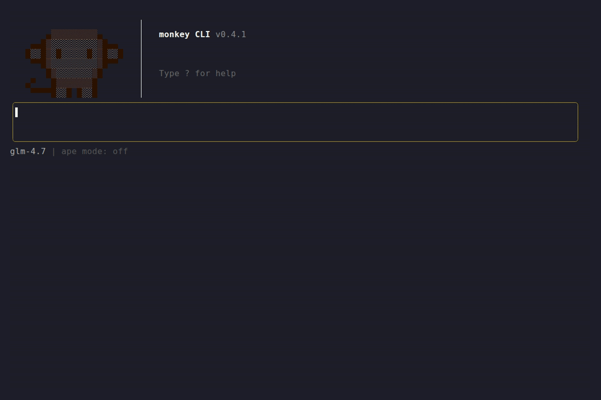

# 🐒 monkey

[](https://github.com/juanhuttemann/monkey-cli/actions/workflows/ci.yml)
[](https://goreportcard.com/report/github.com/juanhuttemann/monkey-cli)
[](go.mod)
[](LICENSE)

**Claude in your terminal. No browser, no copy-pasting — just ask and get things done.**

monkey is an agentic AI assistant that lives where you work. It reads your code, edits files, runs commands, and searches the web. You stay in the terminal; monkey does the rest.



## Why monkey?

- **No context switching** — ask Claude to fix a bug and it edits the file, right there
- **Fully agentic** — Claude can read, write, run commands, and browse the web on your behalf; you approve each action
- **Works the way you do** — interactive TUI for exploration, one-shot CLI for scripting and pipes
- **Project-aware** — drop a `MONKEY.md` in any repo to give Claude permanent context about your codebase

## Get started

```bash
curl -fsSL https://monkeycli.com/install.sh | sh
```

```bash
export ANTHROPIC_API_KEY="your-api-key"
monkey
```

That's it. monkey picks the latest Claude model automatically.

## What it can do

- **Edits your files** — Claude reads your code, makes targeted changes, and shows you a diff before applying
- **Runs commands** — execute shell commands with your approval; ideal for build errors, test failures, or quick scripts
- **Searches the web** — fetch pages and search DuckDuckGo without leaving your session
- **Remembers conversations** — resume any session with `--continue`; never lose a thread
- **Switches models on the fly** — jump between Opus, Sonnet, and Haiku mid-conversation with `/model`
- **Handles long conversations** — `/compact` summarizes and compresses history so you never hit context limits

## Common workflows

```bash
# Fix a bug — monkey reads the file, proposes a fix, applies it
monkey -p "nil pointer panic in api/client.go line 83, fix it"

# Summarize a diff for a PR description
git diff main | monkey -p "write a pull request description for these changes"

# Research and write
monkey -p "find the top Go HTTP routers and write a comparison to docs/routers.md"

# Quick question while staying in flow
monkey -p "what does SIGTERM do vs SIGKILL"

# Pick up where you left off
monkey --continue
```

## Installation

### One-liner (recommended)

```bash
curl -fsSL https://monkeycli.com/install.sh | sh
```

### go install

```bash
go install github.com/juanhuttemann/monkey-cli@latest
```

### From source

```bash
git clone https://github.com/juanhuttemann/monkey-cli.git
cd monkey-cli
go build -o monkey .
```

> Requires Go 1.25 or later.

## Setup

The only required variable is your API key:

```bash
export ANTHROPIC_API_KEY="your-api-key"
```

monkey defaults to the latest Claude model automatically. You can pin specific models if needed:

| Variable | Required | Description |
|---|---|---|
| `ANTHROPIC_API_KEY` | yes | Your Anthropic API key |
| `ANTHROPIC_BASE_URL` | no | Override the API base URL (default: `https://api.anthropic.com`) |
| `ANTHROPIC_DEFAULT_OPUS_MODEL` | no | Pin a specific Opus model ID |
| `ANTHROPIC_DEFAULT_SONNET_MODEL` | no | Pin a specific Sonnet model ID |
| `ANTHROPIC_DEFAULT_HAIKU_MODEL` | no | Pin a specific Haiku model ID |

The active model defaults to the first one set, in order: Opus → Sonnet → Haiku.

> monkey also works with any Anthropic-compatible provider — Kimi, MiniMax, GLM, and others. Just point it at your provider's endpoint, set your API key, and map the model slots to that provider's model IDs.

You can also configure monkey via `~/.config/monkey/config.toml`.

## Usage

### Interactive TUI

```bash
monkey
```

| Key | Action |
|---|---|
| **`/ape`** | **Unleash mode — Claude acts without asking for approval on every tool call** |
| `Enter` | Send message |
| `Ctrl+J` | Insert a newline (multiline input) |
| `/model` + `Enter` | Switch between Opus, Sonnet, and Haiku |
| `/compact` | Summarize and compress history to stay under context limits |
| `/copy` | Copy last response to clipboard |
| `/clear` | Start a new session |
| `Esc` / `Ctrl+C` | Quit |
| `/exit` | Quit via slash command |

### One-shot CLI

```bash
monkey -p "Why do monkeys make the best programmers?"

# Pipe input
monkey -p "summarise this" < file.txt

# Unquoted prompts work too
monkey -p Write a haiku about bananas

# Resume the last session
monkey --continue
```

### Custom system prompt

Create a `MONKEY.md` in your project root and monkey will load it as the system prompt for every conversation in that directory. Use it to give Claude context about your stack, conventions, or anything else it should always know.

A global default lives at `~/.config/monkey/MONKEY.md`.

## Agentic tools

When Claude needs to take action, it calls one of these built-in tools. Each call shows a confirmation prompt — or use `/ape` to auto-approve everything.

| Tool | What it does |
|---|---|
| `bash` | Run a shell command |
| `read` | Read a file |
| `write` | Create or overwrite a file |
| `edit` | Make targeted edits to a file |
| `glob` | Find files by pattern |
| `grep` | Search file contents |
| `web_search` | Search the web via DuckDuckGo |
| `web_fetch` | Fetch and extract text from a URL |

## Running tests

```bash
go test ./...
```

## Contributing

Contributions are welcome! Open an issue first to discuss what you'd like to change. See [CONTRIBUTING.md](CONTRIBUTING.md) for guidelines.

## License

[MIT](LICENSE) © Juan Huttemann
